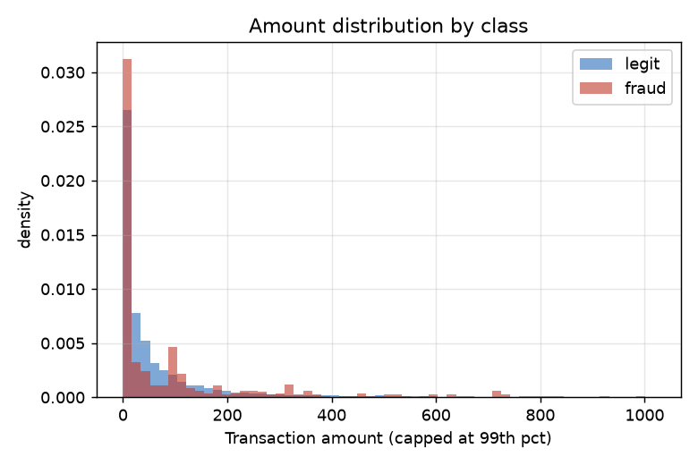

# Data & Model Analysis

All charts are computed **live** from the **real** Credit-Card Fraud dataset
(284,807 transactions) and freshly trained models — including the
`scale_pos_weight` sweep and the per-seed variance study, which re-run the
actual preprocessing and a recall-first threshold identical to the pipeline's.
Nothing is hard-coded. Regenerate with:

```bash
python scripts/generate_figures.py          # full (trains ~14 models, ~5 min)
python scripts/generate_figures.py --fast   # curves only (skip figs 8 & 9)
```

---

## 1. The core challenge — extreme class imbalance


577 legitimate transactions for every fraud. This single fact drives every
design decision: it is why accuracy is unsuitable as a metric, why
`scale_pos_weight` is applied, and why a single holdout split is statistically
noisy (only ~71–95 frauds land in each test fold).

## 2. Why `Amount` alone can't separate fraud



Fraudulent and legitimate amounts overlap heavily — fraud is not simply "large
transactions". The signal lives in the PCA components `V1–V28`, which is why a
model (not a rule) is needed.

## 3. Ranking quality — Precision-Recall curve


AUPRC (~0.83) is the appropriate summary under imbalance — far more informative
than ROC-AUC here because it ignores the large true-negative mass. The red dot is
the deployed operating point chosen by the recall-first strategy.

## 4. ROC curve


ROC-AUC ~0.97 looks excellent, but at 577:1 it is optimistic — a model can score
high here while still raising many false alarms. Shown for completeness; AUPRC
is the primary decision metric.

## 5. The decisive chart — threshold trade-off


This is the heart of the project. As the decision threshold moves:

* **max-F1** (grey line) lands near a high threshold → high precision but recall
  collapses to ~0.70.
* **recall-first** (black line) sits at the boundary of the recall floor (0.85),
  deliberately accepting lower precision to catch more fraud.

Because a missed fraud costs far more than a false alarm, the pipeline chooses
the recall-first operating point. This chart makes the business trade-off
explicit.

## 6. Confusion matrix at the deployed threshold


Concrete outcome on the held-out test set: how many frauds are caught (true
positives) vs missed (false negatives) and the false-alarm count — the numbers a
fraud-operations team actually cares about.

## 7. Feature importance (gain)


A handful of PCA components dominate. Because the features are pre-anonymised,
these aren't human-interpretable names — which is exactly why SHAP plots are
logged per training run for governance.

## 8. `scale_pos_weight` barely moves AUPRC


A live sweep from 1 → 577 shows AUPRC is essentially flat (~0.82–0.83 across the
whole range). This disproved the intuition that the naive 577 (= negative/
positive ratio) is necessary — it hurts probability calibration without
improving ranking, so it is tuned down to 24. **The threshold strategy, not
`scale_pos_weight`, is the primary lever.**

## 9. Why single-split benchmarks are unreliable


The same code on five different random splits: precision swings from 0.10 to
0.90 and recall from 0.79 to 0.87. With so few frauds per split, the
precision/recall operating point is high-variance — which is why the gate uses
the **stable** metrics (ROC-AUC, AUPRC) plus a recall floor, and why CV-based
gating is the recommended next step.

---

### Talking point summary

| Chart | One-line takeaway |
| --- | --- |
| 1 Imbalance | 577:1 → accuracy is meaningless |
| 5 Threshold trade-off | recall-first beats max-F1 for fraud (business cost) |
| 8 spw sweep | tuned `scale_pos_weight` empirically, didn't trust the default |
| 9 Seed variance | proved the original targets weren't reliably achievable |
