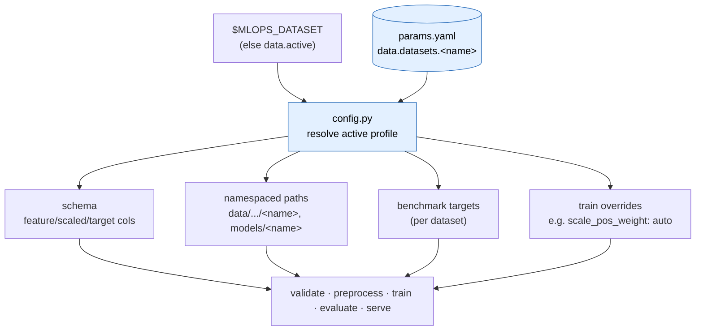
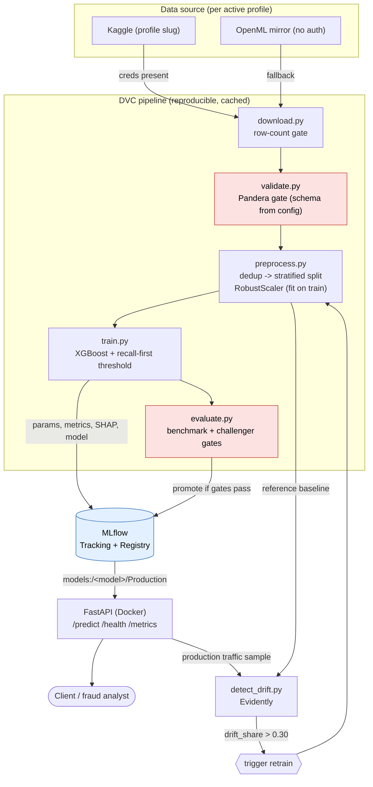
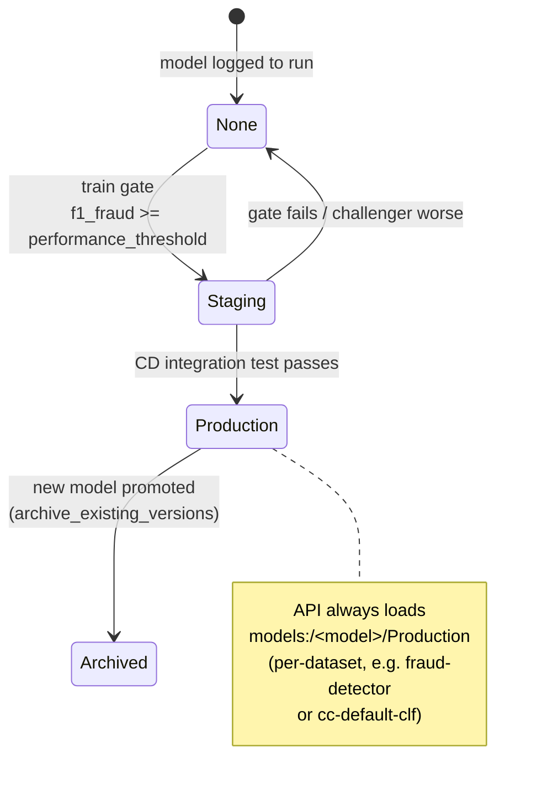
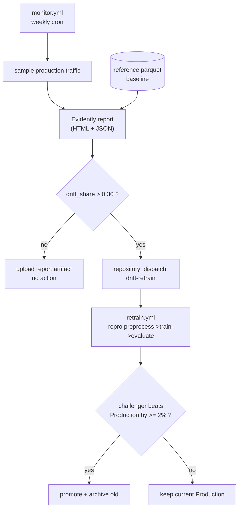
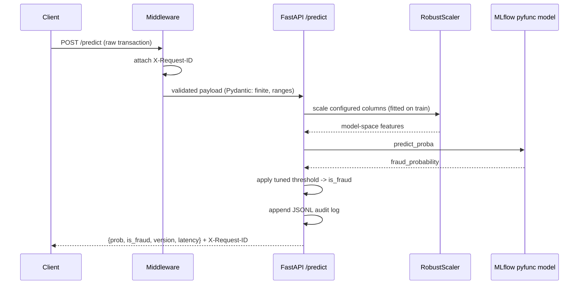
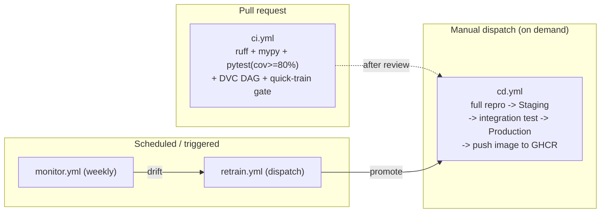

# Architecture & Flow Diagrams

All diagrams use [Mermaid](https://mermaid.js.org/) and render natively on
GitHub and in VS Code. They are the visual companion to the
[README](../README.md).

The pipeline is **dataset-agnostic**: a `data` section in `params.yaml` defines
one profile per dataset, the `MLOPS_DATASET` env var selects the active one, and
all outputs are namespaced per dataset. The same stage code runs on either the
`creditcard` (fraud) or `cc-default` profile — see
[results.md](results.md) and [second_dataset_demo.md](second_dataset_demo.md).

---

## 0. Configuration & dataset selection (config-driven)

`config.py` resolves the active profile **once at import**, so every stage —
including the MLflow pyfunc model reloaded inside `evaluate` — sees the same
schema. This is what makes the pipeline multi-dataset.



Shipped profiles: **`creditcard`** (fraud, 578:1, OpenML 42175) and
**`cc-default`** (credit-card default, 3.5:1, OpenML 42477).

---

## 1. System architecture (end-to-end)



Red nodes are **hard quality gates** that can fail the pipeline.

---

## 2. DVC pipeline DAG

Each stage declares its `deps`, `outs`, `params`, and `metrics`, so DVC caches
and skips unchanged stages and the lineage is fully reproducible.

Outputs are namespaced per dataset (`<name>` = active profile, e.g.
`creditcard`).

```mermaid
flowchart LR
    A["download<br/><i>data/raw/&lt;file&gt;.csv</i>"] --> B["validate<br/><i>validated/&lt;name&gt;/report.json</i>"]
    B --> C["preprocess<br/><i>processed/&lt;name&gt;/*.parquet<br/>models/&lt;name&gt;/scaler.pkl</i>"]
    C --> D["train<br/><i>models/&lt;name&gt;/threshold.json<br/>metrics/&lt;name&gt;/train_metrics.json</i>"]
    D --> E["evaluate<br/><i>metrics/&lt;name&gt;/eval_metrics.json</i>"]

    P[("params.yaml")] -.->|data.* (schema)| B
    P -.->|preprocess.*| C
    P -.->|train.* + per-dataset overrides| D
```

---

## 3. MLflow model promotion lifecycle

Deployment is a **registry stage transition**, never a code change or redeploy.



---

## 4. Drift monitoring → auto-retrain loop



---

## 5. Prediction request flow



The scaling step is the fix for the **train/serve skew** bug — the model trains
on scaled inputs (the profile's configured columns, e.g. `Time`/`Amount`), so
the API must transform raw request values with the same fitted scaler before
scoring.

---

## 6. CI/CD topology



The canonical workflows target the default `creditcard` profile; any other
dataset profile runs the same stages via `MLOPS_DATASET=<name>` (a CI matrix
could fan out across profiles).
