# Results — Three Organic Datasets

Consolidated results from running the **same config-driven pipeline** on three
**organic** datasets (no synthetic data). `creditcard` is the default profile;
the others run via `MLOPS_DATASET=<name>`. All numbers are on the held-out test
split (stratified, for cross-dataset comparability).

| | `creditcard` (fraud) | `cc-default` (default) | `elliptic` (AML) |
| --- | --- | --- | --- |
| Source | Kaggle `mlg-ulb/creditcardfraud` / OpenML 42175 | OpenML 42477 (Yeh & Lien 2009) | Kaggle `ellipticco/elliptic-data-set` |
| Rows (usable) | 284,807 → 283,726 dedup | 30,000 → 29,965 | 46,564 labelled nodes |
| Features | 30 (`Time`,`Amount`,`V1..V28`, PCA) | 23 (`x1..x23`) | 165 (`f1..f165`, anonymised) |
| Positives | 492 | 6,636 | 4,545 |
| Imbalance | **578 : 1** (0.17%) | **3.5 : 1** (22.1%) | **9.2 : 1** (9.76%) |
| Task | detect fraudulent transactions | predict next-month default | detect illicit BTC transactions |

## Configuration used (per dataset)

| Hyperparameter | `creditcard` | `cc-default` | `elliptic` |
| --- | --- | --- | --- |
| n_estimators / max_depth / lr | 400 / 4 / 0.05 | 400 / 4 / 0.05 | 400 / 4 / 0.05 |
| `scale_pos_weight` | 24 (tuned) | 3.52 (auto) | 9.2 (auto) |
| `min_recall` (threshold floor) | 0.85 | 0.65 | 0.65 |
| chosen decision threshold | 0.130 | 0.472 | 0.996 |

Same code; only the `params.yaml` profile differs.

## Holdout metrics (stratified split)

| Metric | `creditcard` | `cc-default` | `elliptic` |
| --- | --- | --- | --- |
| ROC-AUC | **0.971** | **0.772** | **0.995** |
| Average precision (AUPRC) | **0.834** | **0.552** | **0.980** |
| Recall (positive) | 0.831 | 0.642 | 0.689 |
| Precision (positive) | 0.678 | 0.434 | 0.998 |
| F1 (positive) | 0.747 | 0.518 | 0.815 |
| Test positives (support) | 71 | 995 | 682 |

> ⚠️ **`elliptic` is graph data evaluated tabularly on a random split** — that's
> optimistic for this dataset. On the dataset paper's *temporal* protocol the
> numbers are lower and a concept-drift collapse appears; see
> [elliptic_analysis.md](elliptic_analysis.md) for the paper-comparable
> evaluation.

## Visual comparison across all three datasets

The same model and threshold policy on all three test sets, on shared axes —
generated live by [scripts/generate_dataset_figures.py](../scripts/generate_dataset_figures.py)
and [scripts/generate_comparison.py](../scripts/generate_comparison.py).

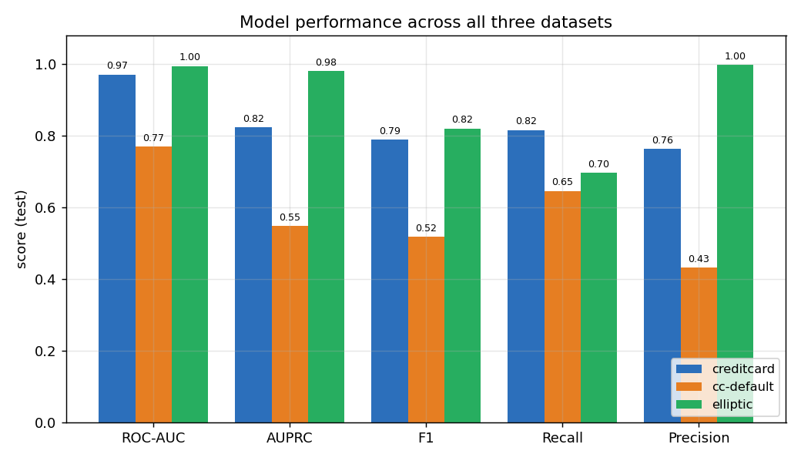

| ROC — all datasets | Precision-Recall — all datasets |
| --- | --- |
| 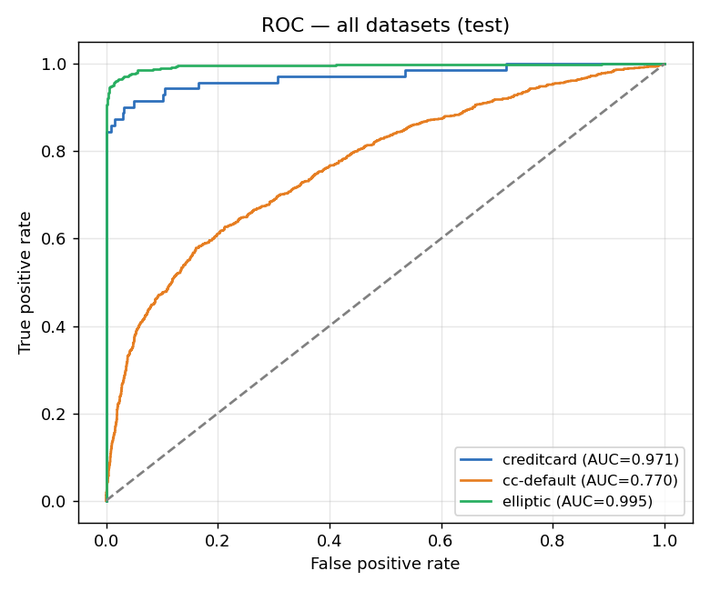 | 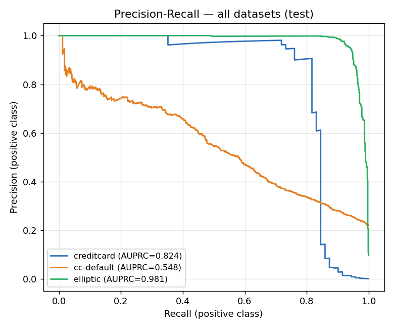 |

The **threshold-independent** metrics (ROC-AUC, AUPRC) are the fair cross-dataset
comparison. The operating-point metrics (F1/precision/recall) shift slightly from
the table above because these charts are an **independent retrain** and the
credit-card operating point is high-variance at 578:1 — exactly the point the
[variance study](analysis.md) makes. The ranking is stable: `elliptic` (easy on a
random split) ≥ `creditcard` ≥ `cc-default` (the hardest, lowest-signal problem).

## Benchmark gate (per-dataset, from `params.yaml`)

All three **passed their own gate** (`evaluate --stage holdout` exited 0):

| Metric | `creditcard` | `cc-default` | `elliptic` |
| --- | --- | --- | --- |
| roc_auc | ≥ 0.96 / 0.971 ✅ | ≥ 0.74 / 0.772 ✅ | ≥ 0.95 / 0.995 ✅ |
| avg_precision | ≥ 0.80 / 0.834 ✅ | ≥ 0.50 / 0.552 ✅ | ≥ 0.90 / 0.980 ✅ |
| recall | ≥ 0.78 / 0.831 ✅ | ≥ 0.55 / 0.642 ✅ | ≥ 0.60 / 0.689 ✅ |
| precision | ≥ 0.60 / 0.678 ✅ | ≥ 0.30 / 0.434 ✅ | ≥ 0.80 / 0.998 ✅ |

## Vs published literature (sanity check)

Threshold-independent metrics (ROC-AUC, AUPRC) land on each dataset's ceiling:

| | Measured ROC-AUC / AUPRC | Published (GBM) |
| --- | --- | --- |
| `creditcard` | 0.971 / 0.834 | ~0.97–0.98 / ~0.85 |
| `cc-default` | 0.772 / 0.552 | ~0.77–0.78 / ~0.54–0.56 |
| `elliptic` (random) | 0.995 / 0.980 | RF F1 0.787 (paper, *temporal*) |

For `elliptic` the like-for-like comparison is the **temporal** split: temporal
F1 **0.753** vs the paper's RF **0.787** — see
[elliptic_analysis.md](elliptic_analysis.md). The high random-split numbers are
not directly comparable to the paper.

## Stability & how to read the gaps

- `creditcard` 5-fold/5-seed: ROC-AUC **0.976 ± 0.01**, AUPRC **0.82 ± 0.02**.
  The precision/recall operating point is high-variance at 578:1 (~71 holdout
  frauds), so the gate uses the stable metrics plus a recall floor.
- `cc-default` scores lower because **default prediction is a harder, lower-
  signal problem** — not a pipeline failure; it's gated on its own realistic bar.
- `elliptic` scores high on a random split but **fails to generalise across the
  dark-market-shutdown concept drift** under temporal evaluation — the textbook
  argument for the drift-monitoring + retraining loop this project ships.

Accuracy is deliberately never used (meaningless at imbalance).

## Figures

**`creditcard`** (`docs/images/`):

| | |
| --- | --- |
| 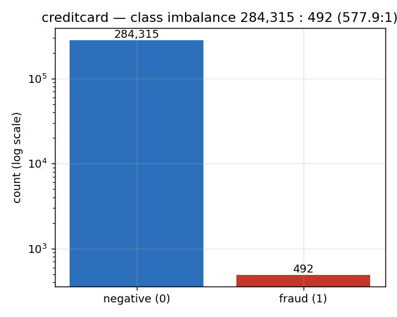 | 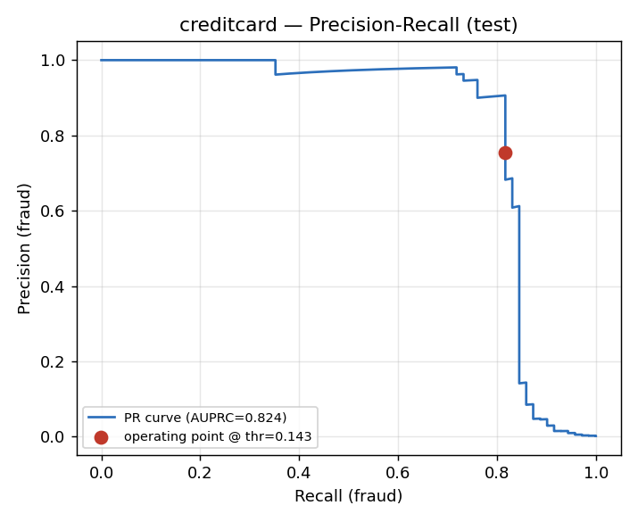 |
| 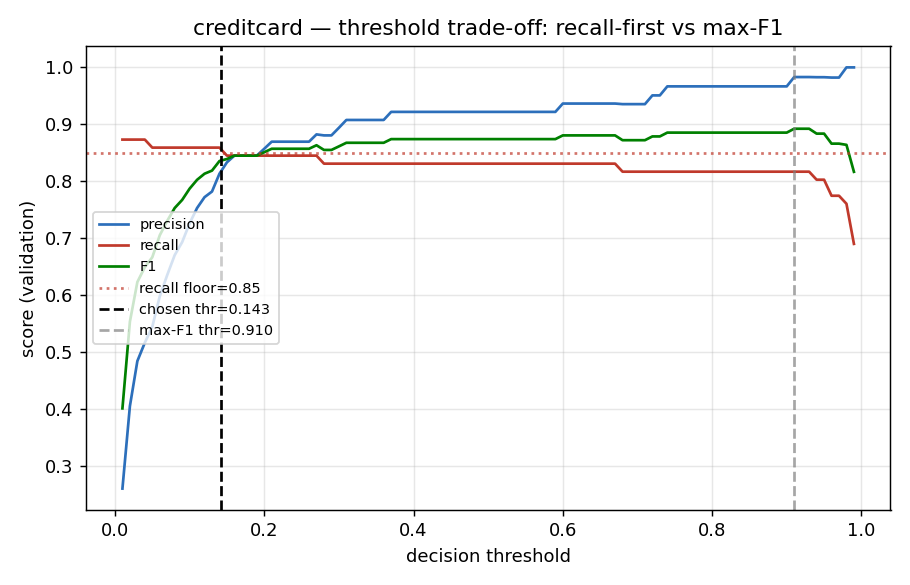 | 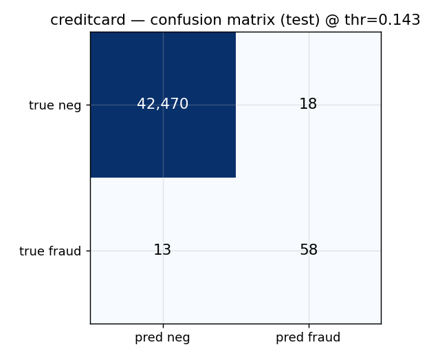 |
| 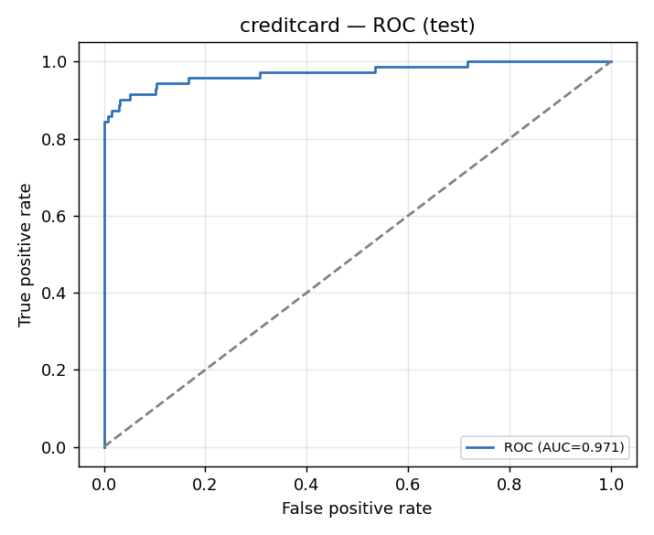 | 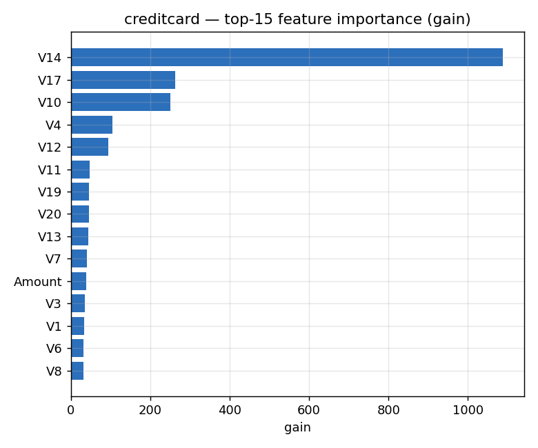 |
|  |  |

**`cc-default`** (`docs/images/cc-default/`):

| | |
| --- | --- |
| 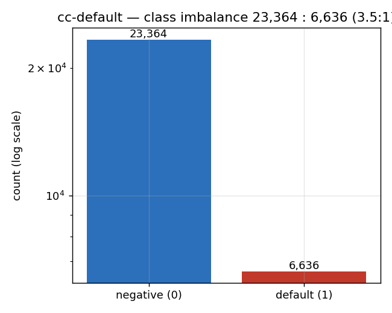 | 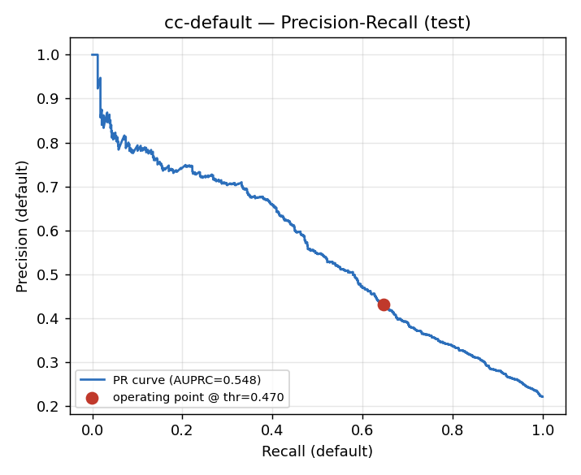 |
| 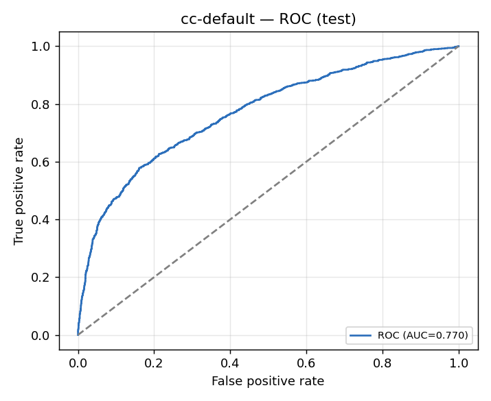 | 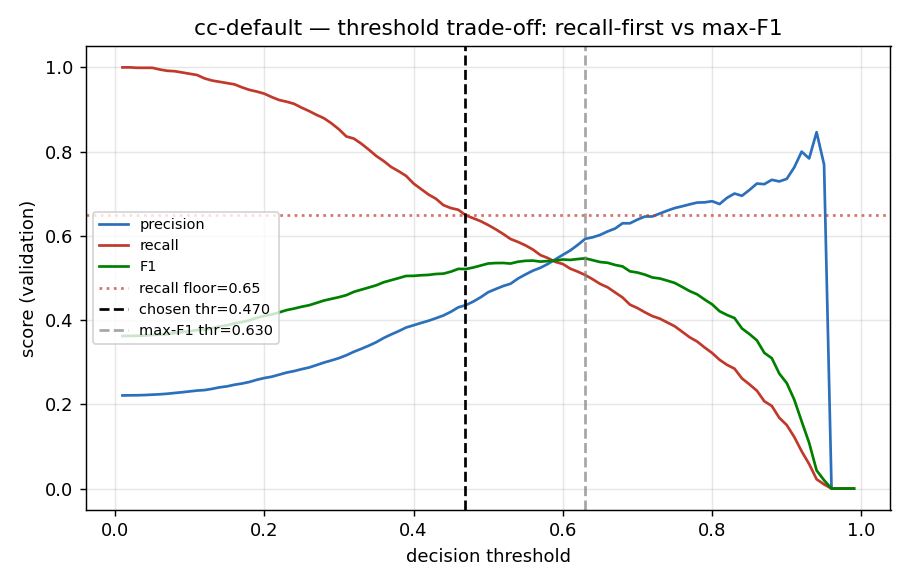 |
| 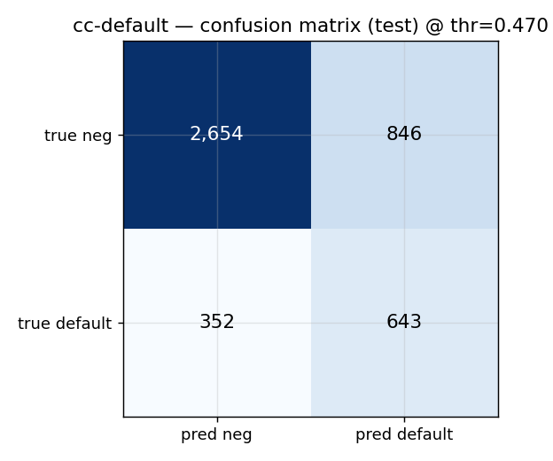 | 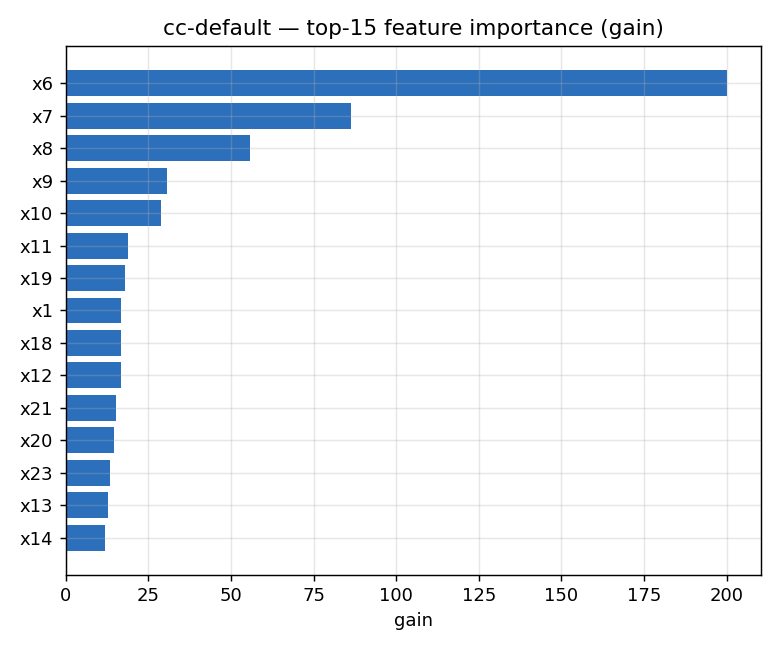 |
| 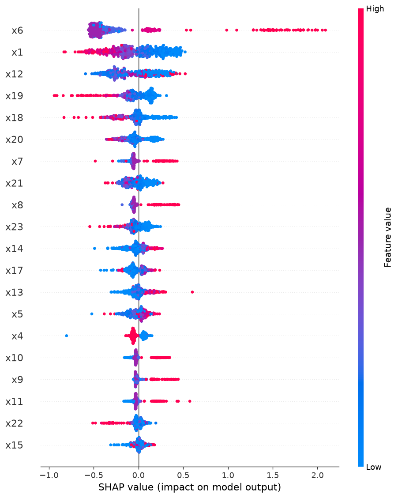 | |

**`elliptic`** (`docs/images/elliptic/`):

| | |
| --- | --- |
| 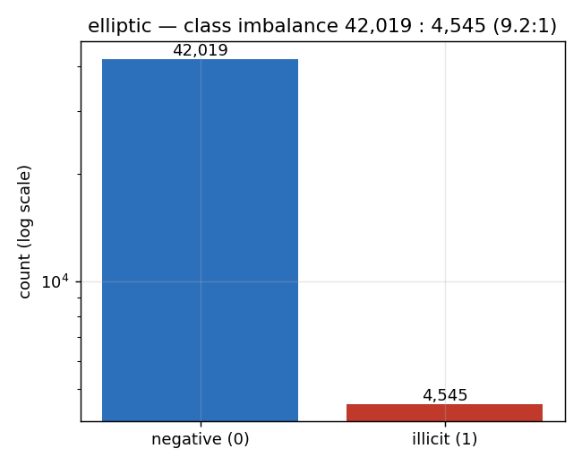 | 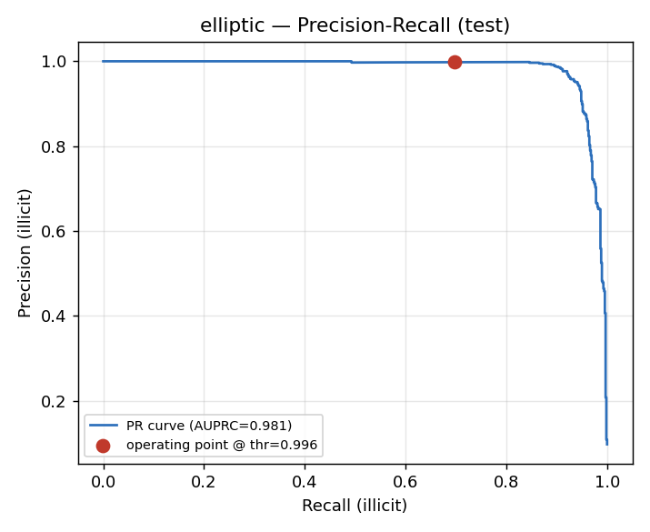 |
| 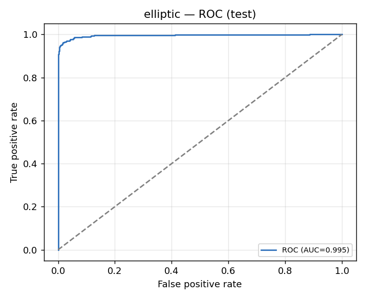 | 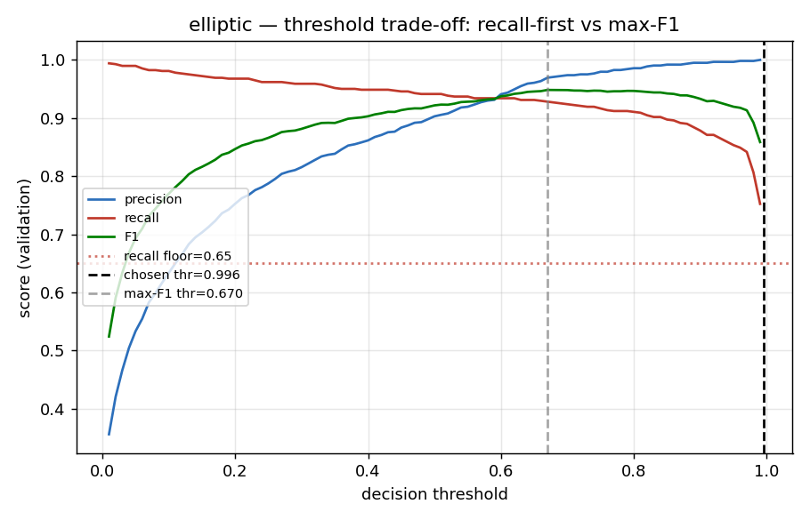 |
| 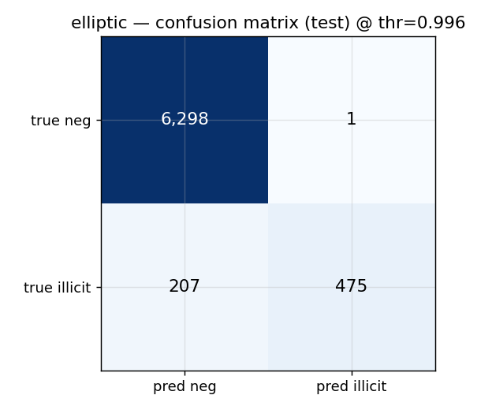 | 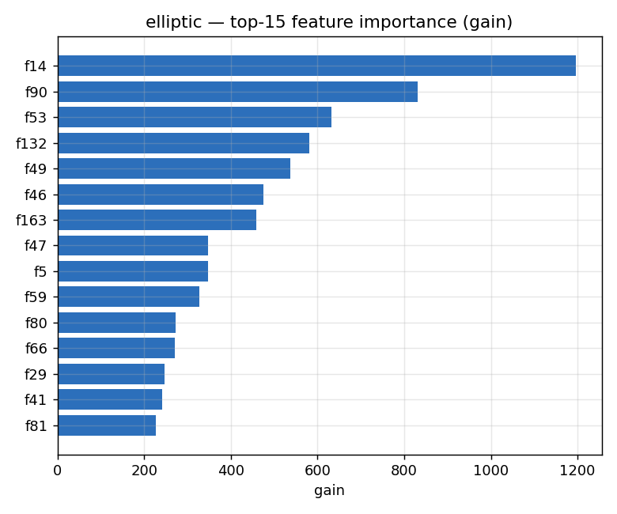 |

## Reproduce

```bash
# creditcard (default profile)
dvc repro

# another profile (cc-default | elliptic) — identical stage code
MLOPS_DATASET=elliptic MLFLOW_TRACKING_URI=sqlite:///mlflow.db \
  python -m src.data.download && python -m src.data.validate && \
  python -m src.data.preprocess && python -m src.models.train && \
  python -m src.models.evaluate --stage holdout

# elliptic, paper-comparable temporal evaluation
python scripts/elliptic_temporal_eval.py

# regenerate the figures for one dataset, then the cross-dataset comparison
MLOPS_DATASET=elliptic python scripts/generate_dataset_figures.py \
  --outdir docs/images/elliptic --dump /tmp/elliptic.npz
python scripts/generate_comparison.py \
  --dumps /tmp/creditcard.npz /tmp/cc-default.npz /tmp/elliptic.npz \
  --outdir docs/images/comparison
```

See [elliptic_analysis.md](elliptic_analysis.md) for the temporal/paper
comparison, [second_dataset_demo.md](second_dataset_demo.md) for the cc-default
walkthrough, and [analysis.md](analysis.md) for the creditcard chart commentary.
