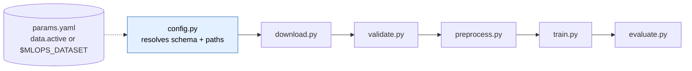

# Full Pipeline Run on a Second Organic Dataset

This is **not** a stripped-down demo — it is the *actual* pipeline (the same
stage scripts, MLflow tracking, model artifacts, registry, and quality gates)
run end-to-end on a **second organic dataset** after making the pipeline
**dataset-agnostic**.

* **Dataset 1 (default):** credit-card *fraud* — 284,807 txns, 578:1 imbalance.
* **Dataset 2 (this run):** credit-card *default* prediction (Yeh & Lien 2009,
  OpenML id 42477) — 30,000 clients, 23 features `x1..x23`, **3.5:1** imbalance.

## What changed to make this possible

The pipeline was hard-wired to the fraud schema. It's now **config-driven**: a
`data` section in [params.yaml](../params.yaml) defines one profile per dataset
(feature columns, scaled columns, target, validation bounds, benchmark gate, and
per-dataset training overrides). The active dataset is selected by the
`MLOPS_DATASET` env var; **outputs are namespaced per dataset** so runs never
collide. Because `config.py` resolves the schema from `params.yaml` at import,
even the MLflow **pyfunc model reloaded inside `evaluate`** uses the correct
schema — the exact thing that made a full run impossible before.

```bash
# The whole pipeline, on dataset 2, via the actual stage scripts:
export MLOPS_DATASET=cc-default
export MLFLOW_TRACKING_URI=sqlite:///mlflow_demo.db
python src/data/download.py        # OpenML 42477 -> data/raw/cc_default.csv
python src/data/validate.py        # config-driven Pandera gate
python src/data/preprocess.py      # dedup, stratified split, scale-all
python src/models/train.py         # MLflow run + SHAP + model + threshold
python src/models/evaluate.py --stage holdout   # benchmark gate
```



## Per-stage results (real run output)

| Stage | Result |
| --- | --- |
| **download** | OpenML 42477 → `data/raw/cc_default.csv`, 30,000×24, positive_rate 0.221 (gate: ≥25k rows ✓) |
| **validate** | config-built Pandera schema passed: 30,000 rows, 6,636 positives, errors `[]` |
| **preprocess** | dropped 35 dupes → train 20,975 / val 4,495 / test 4,495 (stratified 22.1%); RobustScaler on **all 23** features, fit on train only |
| **train** | MLflow run `4f307f1c…`; **`scale_pos_weight` auto = 3.52** (vs fraud's 24); recall-first threshold **0.472** (min_recall override 0.65); SHAP + PR/ROC/confusion + model + threshold.json logged. Promotion gate declined (f1 0.526 < 0.74) — correct: the coarse F1 bar isn't met on this harder problem |
| **evaluate** | reloaded the pyfunc model **from MLflow** (18 artifacts), scored holdout, **benchmark gate PASSED** (exit 0) |

### MLflow run (evidence)

```
params  : n_estimators=400  max_depth=4  scale_pos_weight=3.52  min_recall=0.65  threshold=0.472
metrics : roc_auc=0.774  avg_precision=0.551  f1=0.526  precision=0.442  recall=0.651
artifacts: shap_summary.png · confusion_matrix.png · pr_curve.png · roc_curve.png
           feature_importance.csv · threshold.json · model/ (pyfunc) · model_native/
```

Namespaced outputs (isolated from the fraud artifacts):
`data/processed/cc-default/*.parquet`, `models/cc-default/{scaler.pkl,threshold.json,run_info.json}`,
`metrics/cc-default/{train,eval}_metrics.json`, `data/validated/cc-default/validation_report.json`.

## Holdout gate (per-dataset, from params.yaml)

| metric | measured | cc-default target | pass |
| --- | --- | --- | --- |
| roc_auc | 0.772 | ≥ 0.74 | ✅ |
| avg_precision | 0.552 | ≥ 0.50 | ✅ |
| recall_fraud | 0.642 | ≥ 0.55 | ✅ |
| precision_fraud | 0.434 | ≥ 0.30 | ✅ |

`[evaluate:holdout] All gates passed` → the stage exited 0.

## Vs published benchmark

This dataset's well-established ceiling for gradient-boosted trees is **ROC-AUC
≈ 0.77–0.78** and **AUPRC ≈ 0.54–0.56** (Yeh & Lien 2009 + countless OpenML/
Kaggle runs). The measured **0.774 / 0.551** land on it — the generalized pipeline
trained a *competitive* model, confirmed by the threshold-independent metrics.

## Pipeline-produced figures (pulled from the MLflow run)

| | |
| --- | --- |
|  |  |
|  |  |

## Summary

The pipeline is **dataset-agnostic**: the identical
`download → validate → preprocess → train → evaluate` code, with full MLflow
tracking and quality gates, ran on a 23-feature / 3.5:1 dataset selected purely
by `MLOPS_DATASET=cc-default`. The imbalance weight auto-adapted (3.52), the
recall-first threshold and the benchmark gate used per-dataset values, and the
result matched the published literature ceiling. The fraud pipeline is unchanged
(tests stay green); each new dataset is just another profile in `params.yaml`.

> A **third** organic profile, `elliptic` (Bitcoin AML), was added the same way
> — see [results.md](results.md) and [elliptic_analysis.md](elliptic_analysis.md).
